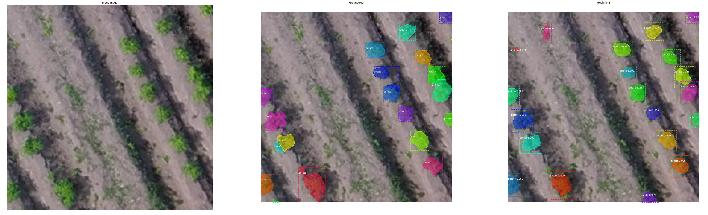
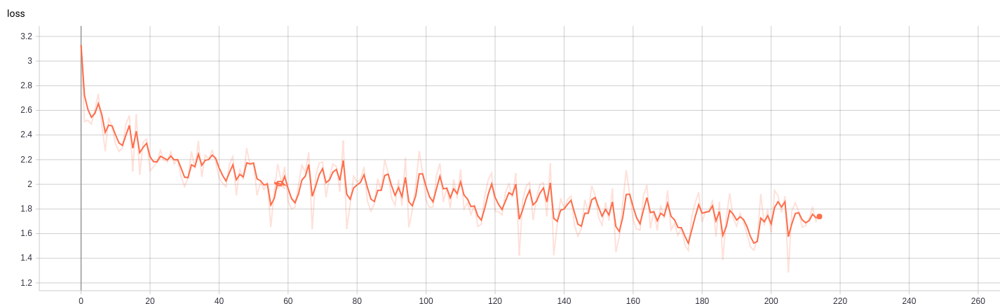
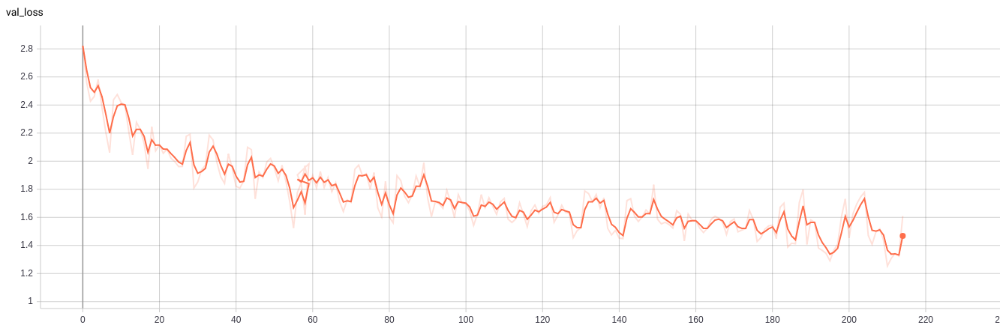
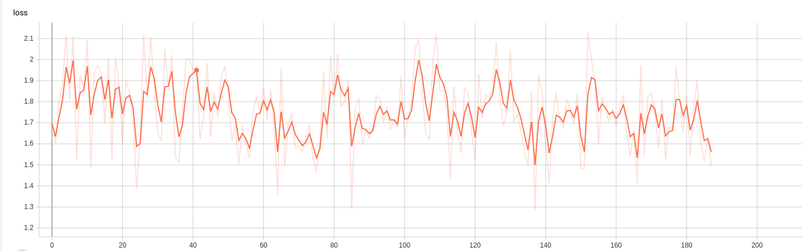
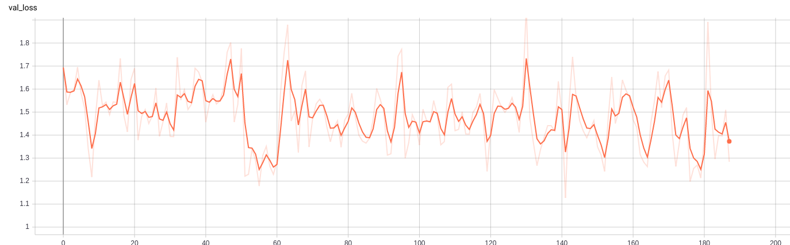

# Mask R-CNN for Object Detection and Segmentation

This is an implementation of [Mask R-CNN](https://arxiv.org/abs/1703.06870) on Python 3, Keras, and TensorFlow. The model generates bounding boxes and segmentation masks for each instance of an object in the image. It's based on Feature Pyramid Network (FPN) and a ResNet101 backbone.

This is an extension of the repository [matterpoort/Mask_RCNN](https://github.com/matterport/Mask_RCNN)


The repository includes:
* Source code of Mask R-CNN built on FPN and ResNet101.
* Training code for MS COCO
* Pre-trained weights for MS COCO
* Jupyter notebooks to visualize the detection pipeline at every step
* Evaluation on MS COCO metrics (AP)
* Example of training on your own dataset

# Getting Started


* [train_potato.ipynb](samples/potato/retrain_potato.ipynb) shows how to train Mask R-CNN on your own dataset. This notebook introduces a toy dataset (Shapes) to demonstrate training on a new dataset.

* ([model.py](mrcnn/model.py), [utils.py](mrcnn/utils.py), [config.py](mrcnn/config.py)): These files contain the main Mask RCNN implementation. 


* [inspect_potato_data.ipynb](samples/potato/inspect_potato_data.ipynb). This notebook visualizes the different pre-processing steps
to prepare the training data.

* [inspect_potato_model.ipynb](samples/potato/inspect_potato_model.ipynb) This notebook goes in depth into the steps performed to detect and segment objects. It provides visualizations of every step of the pipeline. #TODO

* [inspect_potato_weights.ipynb](samples/potato/inspect_potato_weights.ipynb)
This notebooks inspects the weights of a trained model and looks for anomalies and odd patterns.#TODO


# Step by Step Detection
To help with debugging and understanding the model, there are 3 notebooks 
([inspect_potato_data.ipynb](samples/potato/inspect_potato_data.ipynb), [inspect_potato_model.ipynb](samples/potato/inspect_potato_model.ipynb),
[inspect_potato_weights.ipynb](samples/potato/inspect_potato_weights.ipynb)) that provide a lot of visualizations and allow running the model step by step to inspect the output at each point. Here are a few examples:


# Training on potato dataset


We're providing pre-trained weights for MS COCO to make it easier to start. You can use those weights as a starting point to train your own variation on the network. Training and evaluation code is in samples/potato/potato.py. You can import this module in Jupyter notebook (see the provided notebooks for examples) or you can run it directly from the command line as such:

TODO: implement this code
```
# Train a new model starting from pre-trained COCO weights
python samples/potato/potato.py train --dataset=/path/to/coco/ --model=coco

# Train a new model starting from ImageNet weights
python samples/potato/potato.py train --dataset=/path/to/coco/ --model=imagenet

# Continue training a model that you had trained earlier
python samples/potato/potato.py train --dataset=/path/to/coco/ --model=/path/to/weights.h5

# Continue training the last model you trained. This will find
# the last trained weights in the model directory.
python samples/potato/potato.py train --dataset=/path/to/coco/ --model=last
```

You can also run the POTATO evaluation code with:
```
# Run POTATO evaluation on the last trained model
python samples/potato/potato.py evaluate --dataset=/path/to/coco/ --model=last
```

The training schedule, learning rate, and other parameters should be set in `samples/potato/potato.py`.


# Training any other Dataset
 
This model has been coded so that it will easily be extended to any other crop we want to perform semantic segmentation on.

Start by reading this [blog post about the balloon color splash sample](https://engineering.matterport.com/splash-of-color-instance-segmentation-with-mask-r-cnn-and-tensorflow-7c761e238b46). It covers the process starting from annotating images to training to using the results in a sample application.

In summary, to train the model on your own dataset you'll need to extend two classes:

```Config```
This class contains the default configuration. Subclass it and modify the attributes you need to change.

```Dataset```
This class provides a consistent way to work with any dataset. 
It allows you to use new datasets for training without having to change 
the code of the model. It also supports loading multiple datasets at the
same time, which is useful if the objects you want to detect are not 
all available in one dataset. 

See more examples in [matterpoort/Mask_RCNN](https://github.com/matterport/Mask_RCNN)
 `samples/shapes/train_shapes.ipynb`, `samples/coco/coco.py`, `samples/balloon/balloon.py`, and `samples/nucleus/nucleus.py`.


## Differences from the Official Paper
This implementation follows the Mask RCNN paper for the most part, but there are a few cases where we deviated in favor of code simplicity and generalization. These are some of the differences we're aware of. If you encounter other differences, please do let us know.

* **Image Resizing:** To support training multiple images per batch we resize all images to the same size. For example, 1024x1024px on MS COCO. We preserve the aspect ratio, so if an image is not square we pad it with zeros. In the paper the resizing is done such that the smallest side is 800px and the largest is trimmed at 1000px.
* **Bounding Boxes**: Some datasets provide bounding boxes and some provide masks only. To support training on multiple datasets we opted to ignore the bounding boxes that come with the dataset and generate them on the fly instead. We pick the smallest box that encapsulates all the pixels of the mask as the bounding box. This simplifies the implementation and also makes it easy to apply image augmentations that would otherwise be harder to apply to bounding boxes, such as image rotation.

    To validate this approach, we compared our computed bounding boxes to those provided by the COCO dataset.
We found that ~2% of bounding boxes differed by 1px or more, ~0.05% differed by 5px or more, 
and only 0.01% differed by 10px or more.

* **Learning Rate:** The paper uses a learning rate of 0.02, but we found that to be
too high, and often causes the weights to explode, especially when using a small batch
size. It might be related to differences between how Caffe and TensorFlow compute 
gradients (sum vs mean across batches and GPUs). Or, maybe the official model uses gradient
clipping to avoid this issue. We do use gradient clipping, but don't set it too aggressively.
We found that smaller learning rates converge faster anyway so we go with that.

## Citation
Use this bibtex to cite this repository:
```
@misc{matterport_maskrcnn_2017,
  title={Mask R-CNN for object detection and instance segmentation on Keras and TensorFlow},
  author={Waleed Abdulla},
  year={2017},
  publisher={Github},
  journal={GitHub repository},
  howpublished={\url{https://github.com/matterport/Mask_RCNN}},
}
```

## Requirements
Python 3.4, TensorFlow-gpu 1.3, Keras 2.0.8 and other common packages listed in `requirements.txt`.

## Installation
1. Install dependencies
   ```bash
   pip install -r requirements.txt
   ```
2. Clone this repository
3. Run setup from the repository root directory
    ```bash
    python setup.py install
    ``` 
4. Download pre-trained COCO weights (mask_rcnn_coco.h5) from the [releases page](https://github.com/matterport/Mask_RCNN/releases) and save it in `model_weights/`.

## Datasets

Please upload the potato dataset and any other dataset under `datasets/dataset_considered` and put the images in `datasets/dataset_considered/images`
and in `datasets/dataset_considered/annotations.json`.

For the potato dataset, annotations should be a .json file with the following format (see [potato dataset confluence_page](https://hummingbirdtech.atlassian.net/wiki/spaces/HT/pages/600604673/2.+Mask+R-CNN+-+DataSet+Preparation)).

```
id_projected_cell_boundary: int
    regions:
        region_id:
                id_intersected_bounding_box: int
                shape_attribute (pixel_coordinates bounding box WITH has_potato=1 hb-potato-detection-metadata.csv)
                    all_points_x: list[int]
                    all_points_y: list[int]
                id_bounding_box: int
image_width: int
image_height: int
dataset_split: str
```

## Current best model (18/03/2019)

The model which has been trained with the most optimal configuration can be found on the `hb-mayfair` in the shared folder `data/Mask-R-CNN-models/`.

The model is `current_best_model_18_03_2019.h5` and   `current_best_model_config_18_03_2019.txt` contains the best model parameters.

This model has been re-trained from the coco weights.

The model has been trained and gave Mean AP the test set of 70 images: 0.3435.

*Training Loss*

*Validation Loss*


As the training as seeming not completely fully done, the model has been retrained again but only  slight improvements have been made.
The final model gave Mean AP the test set of 70 images: 0.3653.

*Re-training: Training Loss*

*Re-training: Validation Loss*


Hyper parameters (found in `current_best_model_config_18_03_2019.txt`) are as following and have been retrieved by a deep understanding on how works Mask R-CNN (documentation to be written #TODO)
 
```python
NAME = "potato"

# Train on 1 GPU and 8 images per GPU. We can put multiple images on each
# GPU because the images are small. Batch size is 8 (GPUs * images/GPU).
GPU_COUNT = 1
IMAGES_PER_GPU = 8


 # Number of classes (including background)
NUM_CLASSES = 1 + 1  # background + 3 shapes


# Use small images for faster training. Set the limits of the small side
# the large side, and that determines the image shape.
IMAGE_MIN_DIM = 256
IMAGE_MAX_DIM = 256
BACKBONE_STRIDES = [4,8,16,32,64]

##********** 1)ANCHORS GENERATION - for RPN*********

#     Length of square anchor side in pixels
RPN_ANCHOR_SCALES = (8, 16, 24,32, 48) 
TOP_DOWN_PYRAMID_SIZE = 256

##********** 2)PROPOSAL LAYER ********* (no deep learning involved here)

 # How many anchors per image to use for RPN training
RPN_TRAIN_ANCHORS_PER_IMAGE = 128 ##in dataset generation

## tf.image.non_max_suppression(boxes,scores,max_output_size,iou_threshold=0.5,...)
# Non-max suppression threshold to filter RPN proposals.
# You can increase this during training to generate more propsals.
RPN_NMS_THRESHOLD=0.7
#A float representing the threshold for deciding whether boxes overlap too much with respect to IOU.    
## POST_NMS_ROIS_TRAINING~ POST_NMS_ROIS_INFERENCE ~proposal_count ~ max_output_size

POST_NMS_ROIS_TRAINING=1500
POST_NMS_ROIS_INFERENCE=800
##********** 3a)TRAINING - DETECTION TARGET LAYER *********

# Maximum number of ground truth instances to use in one image
MAX_GT_INSTANCES = 128


# Reduce training ROIs per image because the images are small and have
# few objects. Aim to allow ROI sampling to pick 33% positive ROIs.
# Number of ROIs per image to feed to classifier/mask heads
# The Mask RCNN paper uses 512 but often the RPN doesn't generate
# enough positive proposals to fill this and keep a positive:negative
# ratio of 1:3. You can increase the number of proposals by adjusting
# the RPN NMS threshold.
TRAIN_ROIS_PER_IMAGE = 128
# Percent of positive ROIs used to train classifier/mask heads
ROI_POSITIVE_RATIO = 0.33

##********** 3B)INFERENCE - DETECTION  LAYER *********

# Non-maximum suppression threshold for detection in DetectionLater
DETECTION_NMS_THRESHOLD=0.33#0.5 above iou_threshold


# Minimum probability value to accept a detected instance
# ROIs below this threshold are skipped in DetectionLater
DETECTION_MIN_CONFIDENCE=0.9

# Max number of final detections
DETECTION_MAX_INSTANCES = 80


# Use a small epoch since the data is simple
STEPS_PER_EPOCH = 30

# use small validation steps since the epoch is small
VALIDATION_STEPS = 10
LEARNING_RATE=0.001


TRAIN_BN=True

```